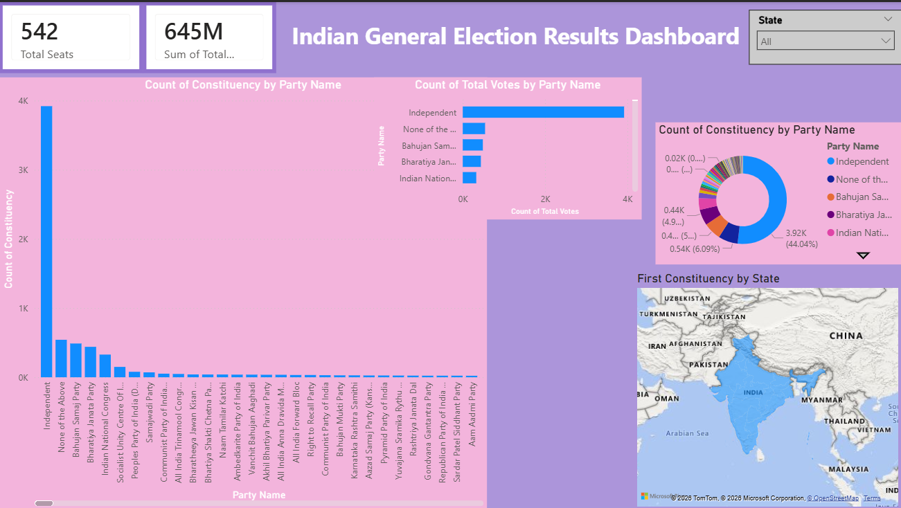
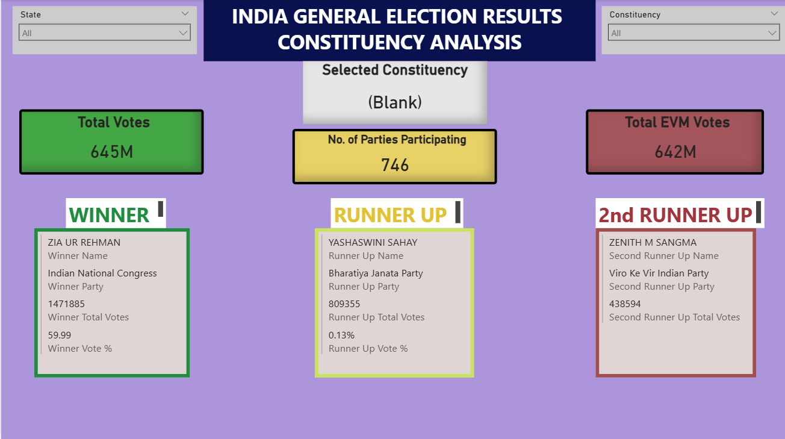

# Indian General Election Results Dashboard

## Project Overview

This project is an interactive Power BI dashboard built to analyze Indian General Election results from multiple perspectives. The dashboard provides a structured view of alliance performance, constituency-level outcomes, and party-wise strategy and performance. It is designed to help users understand election trends through KPIs, charts, maps, and comparative analysis.

The report is divided into multiple dashboard pages so that the analysis is clear, focused, and easy to navigate.

---

## Objectives

The main objectives of this project are:

- To analyze the overall election outcome across India
- To compare the performance of major alliances
- To study constituency-level election results
- To identify winning, runner-up, and second runner-up candidates
- To evaluate party performance using seat share, vote share, and strike rate
- To build an interactive dashboard with slicers and drill-based filtering

---

## Dashboard Pages

### 1. Overview Analysis

This page gives a high-level summary of the Indian General Election results.

Key highlights:
- Total seats won by major alliances such as NDA, INDIA, and Others
- Majority status indicator
- Gauge visuals showing alliance seats against total seats
- Party-wise seat distribution
- Summary table of seats won by major parties

This page helps users quickly understand the overall election result and the seat distribution among alliances and major parties.

---

### 2. General Election Results Dashboard

This page focuses on a broader summary of election participation and vote distribution.

Key highlights:
- Total seats KPI
- Total votes KPI
- Count of constituencies by party name
- Count of total votes by party name
- Donut chart for party-wise constituency distribution
- Map visual for state-level constituency analysis
- State slicer for filtering dashboard results

This page is useful for understanding how different parties are spread across constituencies and how votes are distributed.

---

### 3. Constituency Analysis

This page provides a detailed constituency-level breakdown of election outcomes.

Key highlights:
- Selected constituency display
- Total votes and total EVM votes
- Number of parties participating in the selected constituency
- Winner details:
  - Winner name
  - Winner party
  - Winner total votes
  - Winner vote percentage
- Runner-up details:
  - Runner-up name
  - Runner-up party
  - Runner-up total votes
  - Runner-up vote percentage
- Second runner-up details:
  - Second runner-up name
  - Second runner-up party
  - Second runner-up total votes
- State and constituency slicers for filtering

This page helps in detailed candidate-level and constituency-level result analysis.

---

### 4. Party Strategy and Performance Analysis

This page focuses on party-wise performance evaluation and comparison.

Key highlights:
- Best performing party
- Best party seats KPI
- Selected party display
- Scatter or bubble chart comparing vote share percentage and strike rate percentage
- Party-wise table showing:
  - Total seats won
  - Strike rate percentage

This page is useful for evaluating how efficiently parties converted vote share into seats and for comparing party strategies.

---

## Tools and Technologies Used

- Power BI
- Power Query for data cleaning and transformation
- DAX for calculated measures and KPIs
- Data visualization techniques for dashboard design and storytelling

---

## Work Done in This Project

In this project, I performed the following tasks:

- Collected and organized election-related datasets
- Cleaned and transformed the data in Power Query
- Built data relationships where required
- Created calculated columns and DAX measures for KPIs and analysis
- Designed multiple dashboard pages for different analytical perspectives
- Added slicers for interactive filtering
- Used charts, tables, cards, gauges, donut charts, and maps for better analysis
- Structured the report in a way that makes navigation and interpretation easier

---

## Key Insights Delivered

This dashboard helps answer questions such as:

- Which alliance won the highest number of seats?
- Whether a clear majority was achieved or not
- Which parties performed best in terms of seats won
- How votes and constituencies are distributed across parties
- Who won, came second, and came third in a constituency
- How party vote share compares with strike rate
- Which party performed most effectively in elections

---

## Screenshots

You can add screenshots of your dashboard pages below. Upload the images to this repository and replace the file names with your actual image names.

### State Analysis


### Constituency Analysis


### Party Strategy and Performance Analysis


### General Election Results Dashboard


---

## How to Use

1. Download or clone this repository
2. Open the `.pbix` file in Power BI Desktop
3. Explore each dashboard page
4. Use the slicers to filter by state, constituency, or party
5. Review KPIs and visuals for insights

---

## Repository Structure

```text
Indian-General-Election-Results-Dashboard/
│
├── README.md
├── Indian_General_Election_Results_Dashboard.pbix
├── dataset/
│   └── election_data_file.csv
└── images/
    ├── overview-analysis.png
    ├── general-election-results-dashboard.png
    ├── constituency-analysis.png
    └── party-strategy-performance-analysis.png
